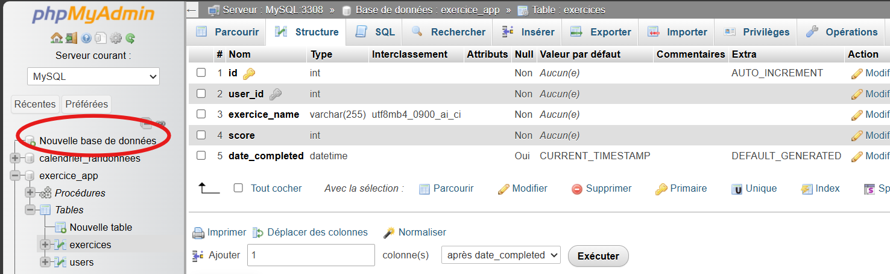
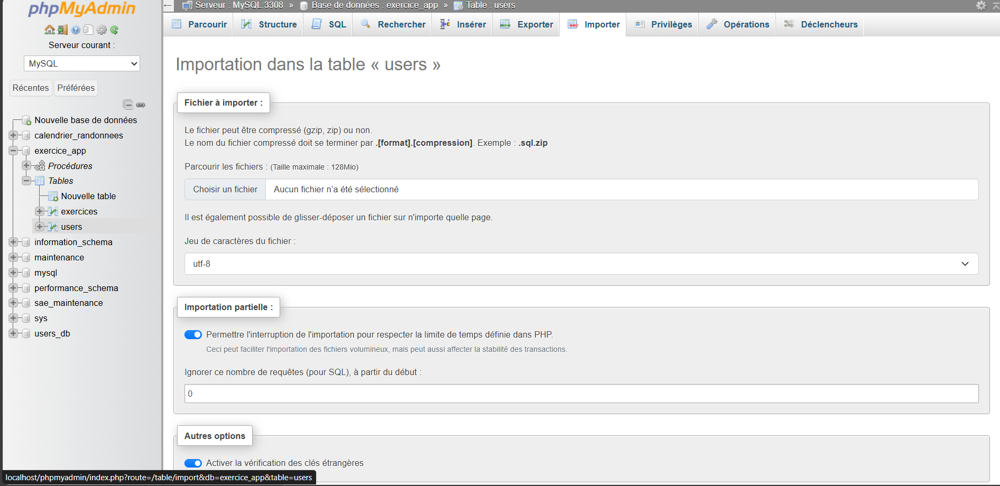

# 📌 Guide d'Installation de la Base de Données MySQL avec PHPMyAdmin  

Bienvenue dans ce guide d'installation qui vous aidera à configurer la base de données pour votre site d'aide maternel.  

---

## 📥 1. Installation de XAMPP ou WAMP  

Avant de configurer la base de données, vous devez installer un serveur local comme **XAMPP** ou **WAMP**, qui inclut **PHP**, **MySQL**, et **PHPMyAdmin**.  

🔹 **Téléchargez et installez XAMPP** ➝ [Apache Friends - XAMPP](https://www.apachefriends.org/fr/index.html)  
🔹 **Téléchargez et installez WAMP** ➝ [WAMP Server](https://www.wampserver.com/)  

---

## 🚀 2. Lancer le Serveur MySQL et PHPMyAdmin  

1️⃣ **Ouvrez XAMPP ou WAMP** et démarrez les services **Apache** et **MySQL**.  
2️⃣ Accédez à **PHPMyAdmin** depuis votre navigateur :  

➡️ [http://localhost/phpmyadmin](http://localhost/phpmyadmin)  

---

## 🗄️ 3. Création de la Base de Données  

### 📌 Étapes :  
1. Ouvrez **PHPMyAdmin**.  
2. Cliquez sur **Nouvelle** dans le menu de gauche.  
3. Entrez un nom pour la base de données, par exemple :  
   **exercice_app**  
4. Cliquez sur **Créer**.  

📷 *Exemple d'interface :*  
  

---

## 📂 4. Importer le Fichier SQL  

Plutôt que de créer manuellement les tables, vous pouvez importer le fichier SQL que j'ai donné contenant la structure et les données des tables et des procécures :  

1️⃣ Allez dans l'onglet **Importer**.  
2️⃣ Cliquez sur **Choisir un fichier** et sélectionnez le fichier **exercice_app.sql**.  
3️⃣ Cliquez sur **Exécuter**.  

✅ Votre base de données est maintenant opérationnelle, félicitations jeune apprenti !

📷 *Exemple d'importation :*  
  

---

## 🔗 5. Liaison PHP & Base de Données  

Pour connecter votre application PHP à MySQL, vous allez créez un fichier **config.php** dans votre projet voici le code que je vous donne pour cela.  

📌 **Exemple de code `config.php` :**  

```php
<?php
// Paramètres de connexion
$host = 'localhost:3308'; // Changez en 'localhost' si MySQL est sur le port de base (3306)
$dbname = 'exercice_app'; 
$username = 'root'; 
$password = ''; 

try {
    // Connexion avec PDO
    $pdo = new PDO("mysql:host=$host;dbname=$dbname", $username, $password);
    $pdo->setAttribute(PDO::ATTR_ERRMODE, PDO::ERRMODE_EXCEPTION);
} catch (PDOException $e) {
    die("❌ Erreur de connexion : " . $e->getMessage());
}
?>
```

Voila maintenant votre base de données est créée et vous avez la saison donc à vous de jouer !

