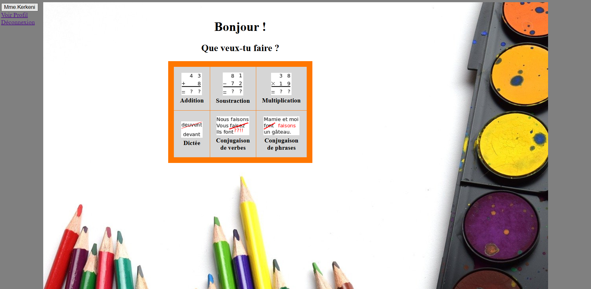
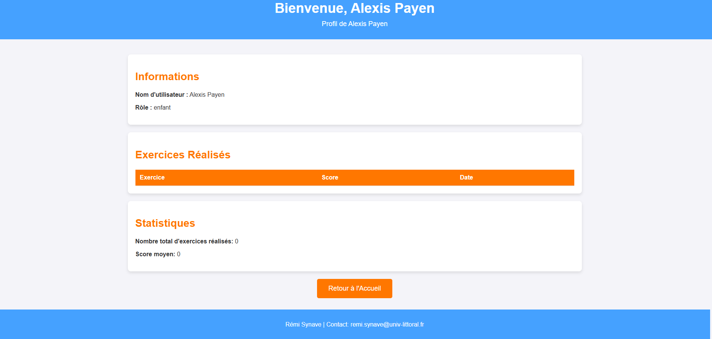
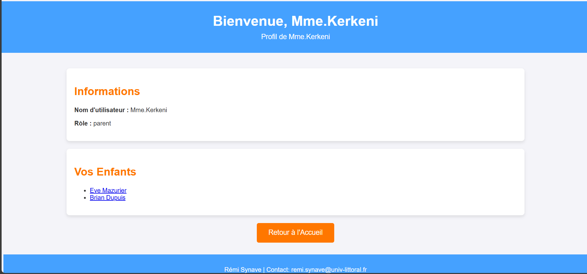
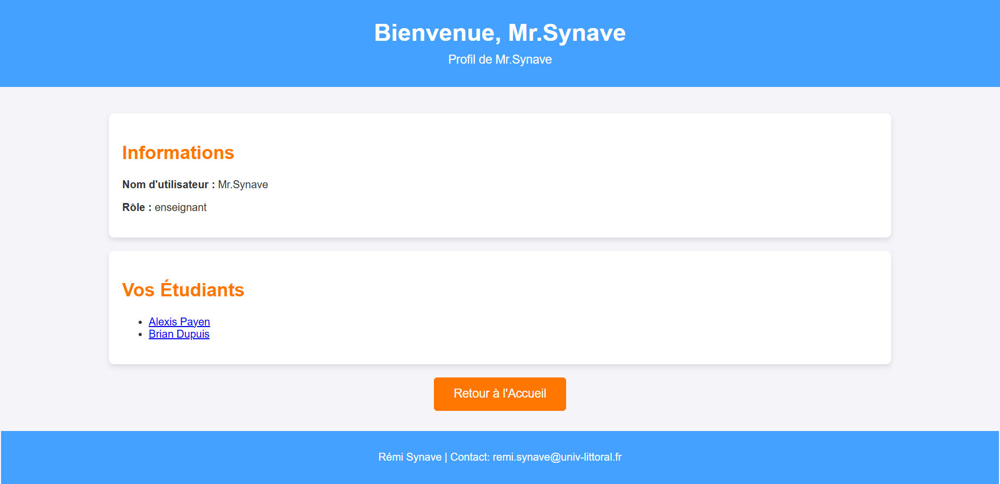

# 📖 Manuel d'Utilisation

## 🏡 Introduction

Bienvenue sur notre plateforme éducative !  
Ce site permet aux enfants de s'entraîner avec des exercices en ligne, aux parents de suivre leurs progrès et aux enseignants de créer des exercices personnalisés pour leurs élèves.

---

## 📝 1. Création d'un Compte

Lors de l'inscription, vous devez choisir un rôle : **Enfant, Parent ou Enseignant**.  

### 👦 Enfant  
- Inscrivez-vous avec votre prénom et votre nom.  
- Choisissez un mot de passe pour accéder à votre espace.  
- Une fois connecté, vous pourrez faire des exercices et voir vos résultats.  

### 👨‍👩‍👧 Parent  
- Inscrivez-vous avec un nom d'utilisateur et un mot de passe.  
- Ajoutez le(s) prénom(s) et nom(s) de votre (vos) enfant(s) pour voir leurs résultats.  

### 👨‍🏫 Enseignant  
- Inscrivez-vous avec un nom d'utilisateur et un mot de passe.  
- Ajoutez les noms des élèves que vous suivez.  
- Vous pourrez créer des exercices personnalisés pour eux.  

---

## 🔑 2. Se Connecter et Accéder à son Profil  

Après l'inscription, connectez-vous avec votre **nom d'utilisateur et votre mot de passe**.

Pour pouvoir accéder à votre profil, cliquez sur **voir profil** comme montré ci-dessous.

🎭 **L'affichage dépend de votre rôle :**  

### 👦 Enfant  
Vous voyez :  
✅ Vos exercices réalisés et vos scores.  
✅ Une nouvelle section **"Exercices Personnalisés"** si un enseignant vous a attribué des exercices spéciaux.  

### 👨‍👩‍👧 Parent  
Vous voyez :  
✅ La liste des exercices et résultats de votre enfant. 

### 👨‍🏫 Enseignant  
Vous voyez :  
✅ Les résultats des élèves associés à votre compte.  
✅ Un espace pour **créer et gérer des exercices personnalisés**.  
✅ La liste des élèves et leurs progrès.  

---

## 📊 3. Voir les Résultats

**👦 Enfants** : Accédez à votre profil pour voir vos résultats et scores.  

**👨‍👩‍👧 Parents** : Consultez le profil de votre enfant pour voir ses performances.  

**👨‍🏫 Enseignants** : Sur votre profil, accédez aux résultats de vos élèves.  

---

## 🎯 4. Fonctionnalités  

### ✏️ Enfants  
- Faites des exercices adaptés à votre niveau.  
- Consultez vos résultats et progrès.  
- Accédez aux **Exercices Personnalisés** créés par votre enseignant.  

### 👨‍👩‍👧 Parents  
- Suivez les progrès de votre enfant.  
- Consultez ses résultats en un coup d'œil.  

### 👨‍🏫 Enseignants  
- **Créez des exercices personnalisés** pour vos élèves.  
- Gérez et suivez leurs résultats.  
- **Chaque élève ne voit que ses propres exercices personnalisés !**  
  - Exemple :  
    - *Brian n'est pas un élève de M. Synave → il ne voit pas ses exercices.*  
    - *Eve est une élève de M. Synave → elle voit ses exercices personnalisés.*  

---

## 📧 Besoin d'aide ?  

Si vous avez des questions ou des problèmes, contactez-nous à ces adresses :  
📩 **Alexis Payen** : [alexispayen2004@mail.com](mailto:alexispayen2004@mail.com)  
📩 **Rémi Synave** : remi.synave@univ-littoral.fr

